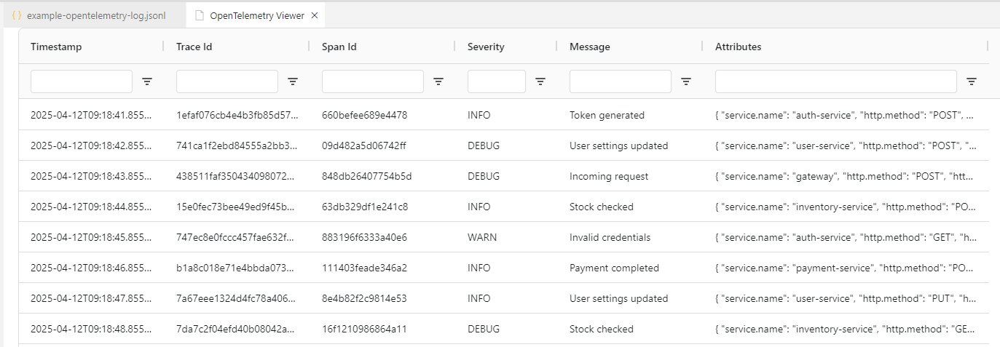

# OpenTelemetry Log Viewer for VS Code

A simple, interactive VS Code extension for exploring [OpenTelemetry](https://opentelemetry.io/) logs using a smart, filterable data grid.

Since there is no solution to view those logs offline?! Here is a simple viewer extension for VSCode:



---

## ✨ Features

- 📊 Displays structured JSON logs in a dynamic AG Grid table
- 🔍 Sort, filter, and search across all columns
- 🚀 One-click toolbar button to open the viewer
- 🧠 Validates file content before rendering the grid
- 🔐 Safe Content Security Policy (CSP) with inline script and style support

---

## 📦 Installation

This extension is currently local-only. To try it out:

```bash
git clone https://github.com/TobiStr/vscode-opentelemetry-viewer.git
cd vscode-opentelemetry-viewer
npm install
npm run build
code .
```

Then press `F5` in VS Code to launch the Extension Development Host.

---

## 🪵 Usage

1. Open any `.log` or `.jsonl` file that contains OpenTelemetry logs in JSON Lines format.
2. Click the **"OpenTelemetry Viewer"** button in the editor toolbar. (Alternatively use the `OpenTelemetry Viewer` command in your command menu `STRG+SHIFT+P`)
3. View your logs in a rich, sortable grid!

> Log entries must be one JSON object per line (JSONL).

---

## 📁 File Types

When these files are open, you will see a button `OpenTelemetry Viewer` on the top right of your editor:

- `.log`
- `.jsonl`

---

## 🛠 Development

### Commands

```bash
npm run build          # Builds the extension and webview
```

### Folder Structure

```
src/
├── extension.ts        # VS Code backend logic
└── webview/            # React-based frontend for the log viewer
    ├── App.tsx
    └── main.tsx
```

---

## 🛡 License & Notice

- [APACHE 2.0](LICENSE)
- [NOTICE](NOTICE)

---

## 🙌 Credits

- Powered by [AG Grid](https://www.ag-grid.com/) for flexible data rendering
- Inspired by the need to finally view these log files offline.

---

> Contributions welcome! Please fork and enhance — and credit the original project.
